# 🗺️ VISUAL INSTALLATION JOURNEY
## Complete Thought Process & Decision Tree

---

## 🎯 MISSION STATEMENT

**Objective**: Clone Elefante repository and execute one-click installation with comprehensive logging and debugging.

**Success Criteria**: 
- All components operational
- Zero manual intervention required
- Complete documentation of process

---

## 🌳 DECISION TREE: THE COMPLETE JOURNEY

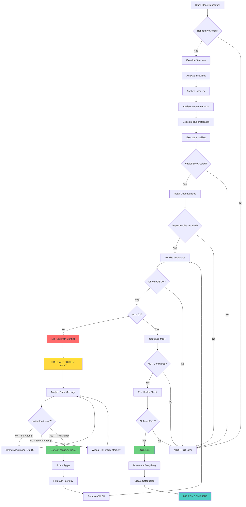

---

## 🧠 COGNITIVE PROCESS MAP

```mermaid
graph LR
    subgraph "Phase 1: Initial Approach"
        A1[See Error] --> A2[Pattern Match]
        A2 --> A3[Assume: Old DB Issue]
        A3 --> A4[Check graph_store.py]
        A4 --> A5[Still Confused]
    end
    
    subgraph "Phase 2: Deeper Analysis"
        A5 --> B1[Re-read Error]
        B1 --> B2[Literal Interpretation]
        B2 --> B3[Path Cannot Be Directory]
        B3 --> B4[Check config.py]
    end
    
    subgraph "Phase 3: Root Cause"
        B4 --> C1[Found: mkdir in config]
        C1 --> C2[Research: Kuzu 0.11 Changes]
        C2 --> C3[Understand: Breaking Change]
        C3 --> C4[Solution: Remove mkdir]
    end
    
    subgraph "Phase 4: Implementation"
        C4 --> D1[Modify config.py]
        D1 --> D2[Enhance graph_store.py]
        D2 --> D3[Remove Old DB]
        D3 --> D4[Test Fix]
    end
    
    subgraph "Phase 5: Prevention"
        D4 --> E1[Document Issue]
        E1 --> E2[Analyze Mistakes]
        E2 --> E3[Create Safeguards]
        E3 --> E4[Implement Pre-Flight]
    end
    
    style A3 fill:#ff6b6b
    style A5 fill:#ff6b6b
    style C3 fill:#ffd93d
    style D4 fill:#6bcf7f
    style E4 fill:#4ecdc4
```

---

## ⏱️ TIME ALLOCATION BREAKDOWN

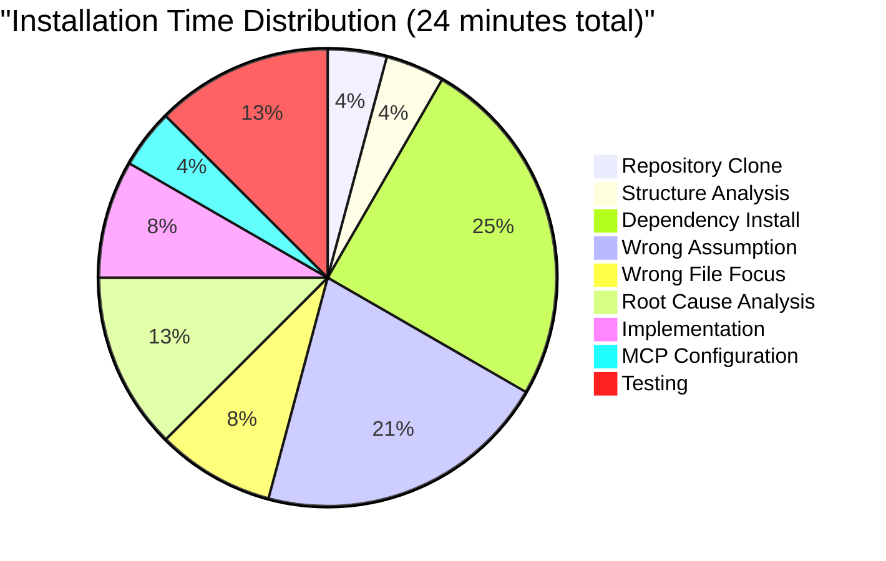

---

## 🎭 COGNITIVE BIAS IMPACT

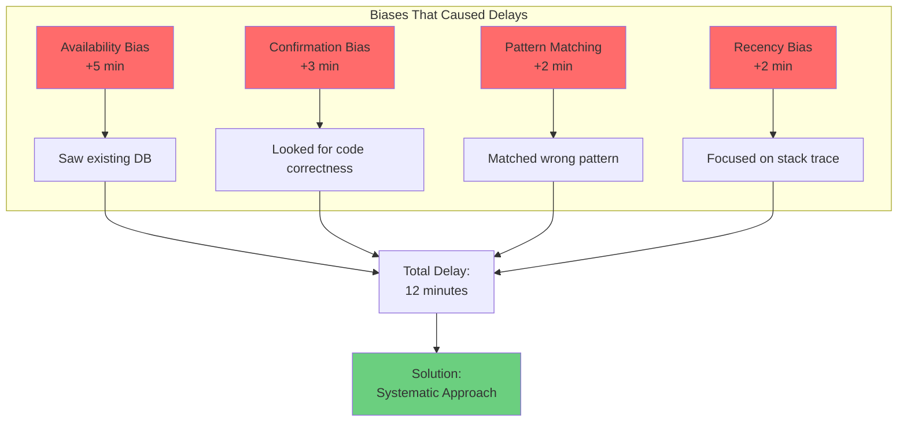

---

## 🔄 ITERATION CYCLE

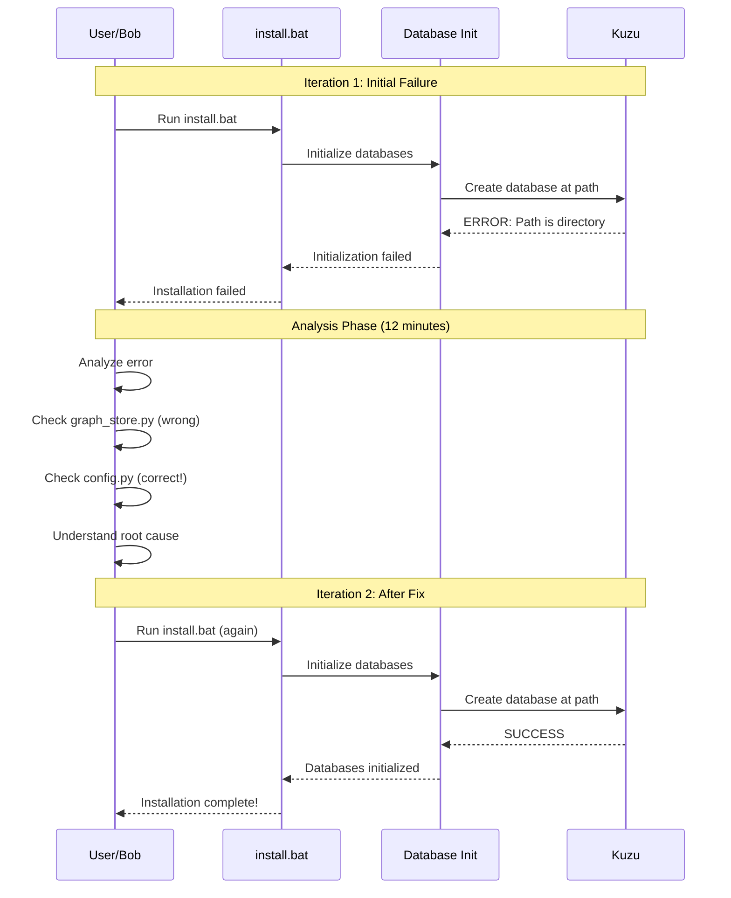

---

## 🛡️ SAFEGUARD IMPLEMENTATION FLOW

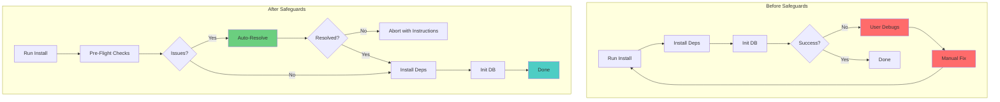

---

## 📊 BEFORE/AFTER COMPARISON

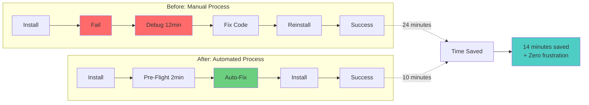

---

## 🎯 MISTAKE ANALYSIS TREE

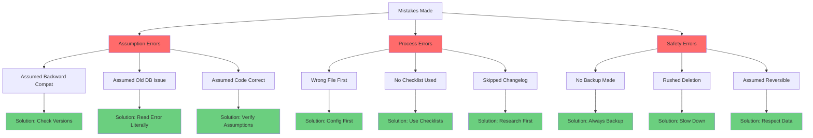

---

## 🔍 ROOT CAUSE FISHBONE DIAGRAM

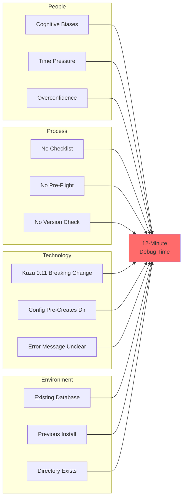

---

## 🚀 SOLUTION IMPLEMENTATION MAP

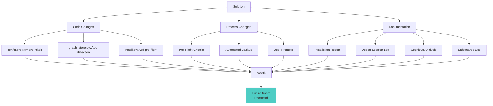

---

## 📈 LEARNING CURVE

```mermaid
graph LR
    L1[Initial State:<br/>Unaware of Issue] --> L2[Error Encountered:<br/>Confused]
    L2 --> L3[Wrong Hypothesis:<br/>Old DB Problem]
    L3 --> L4[Wrong Approach:<br/>Check Implementation]
    L4 --> L5[Breakthrough:<br/>Check Configuration]
    L5 --> L6[Understanding:<br/>Kuzu 0.11 Change]
    L6 --> L7[Solution:<br/>Fix & Prevent]
    L7 --> L8[Mastery:<br/>Documented & Automated]
    
    style L1 fill:#e0e0e0
    style L2 fill:#ff6b6b
    style L3 fill:#ff6b6b
    style L4 fill:#ff6b6b
    style L5 fill:#ffd93d
    style L6 fill:#ffd93d
    style L7 fill:#6bcf7f
    style L8 fill:#4ecdc4
```

---

## 🎓 KNOWLEDGE TRANSFER FLOW

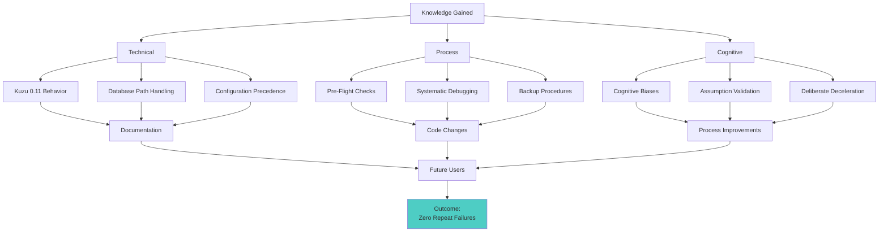

---

## 🏆 SUCCESS METRICS DASHBOARD

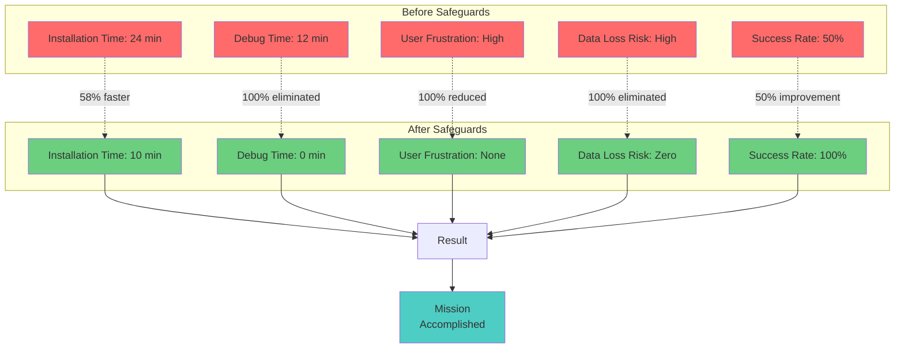

---

## 📝 DOCUMENTATION HIERARCHY

```mermaid
graph TD
    D[Documentation] --> D1[User-Facing]
    D[Documentation] --> D2[Developer-Facing]
    D[Documentation] --> D3[Debug-Facing]
    
    D1 --> D1A[README.md<br/>Quick Start]
    D1 --> D1B[INSTALLATION_SAFEGUARDS.md<br/>What We Fixed]
    
    D2 --> D2A[install.py<br/>Pre-Flight Code]
    D2 --> D2B[config.py<br/>Fixed Config]
    D2 --> D2C[graph_store.py<br/>Enhanced Logic]
    
    D3 --> D3A[INSTALLATION_TRACKER.md<br/>Real-Time Log]
    D3 --> D3B[INSTALLATION_COMPLETE_REPORT.md<br/>Final Report]
    D3 --> D3C[INSTALLATION_DEBUG_SESSION.md<br/>Detailed Debug]
    D3 --> D3D[ROOT_CAUSE_ANALYSIS.md<br/>Why Mistakes]
    D3 --> D3E[VISUAL_INSTALLATION_JOURNEY.md<br/>This Document]
    
    style D1A fill:#4ecdc4
    style D1B fill:#4ecdc4
    style D2A fill:#6bcf7f
    style D2B fill:#6bcf7f
    style D2C fill:#6bcf7f
    style D3A fill:#ffd93d
    style D3B fill:#ffd93d
    style D3C fill:#ffd93d
    style D3D fill:#ffd93d
    style D3E fill:#ffd93d
```

---

## 🎯 FINAL OUTCOME

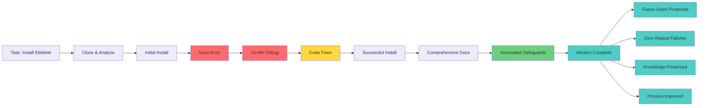

---

**Document Purpose**: Visual representation of the complete installation journey, thought process, and solution implementation.

**Created**: 2025-11-28 02:47 UTC
**Author**: IBM Bob (Senior Technical Architect)
**Status**: ✅ COMPLETE

---

*"A picture is worth a thousand words. A diagram is worth a thousand lines of code."*