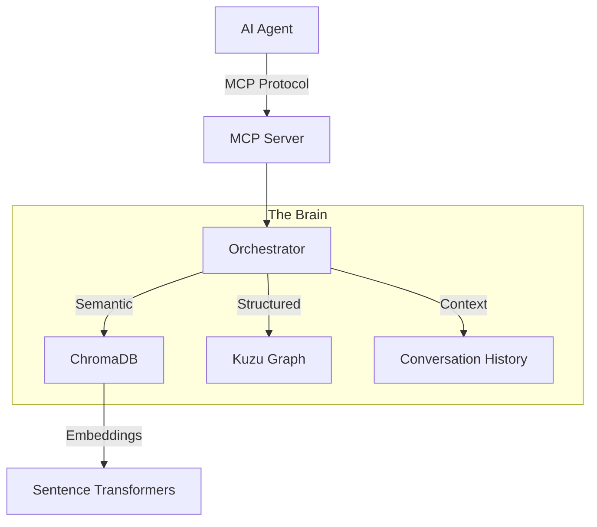

# 🐘 Elefante - Local AI Memory System

> **"An elephant never forgets"** - Give your AI assistant perfect memory with local, private, and intelligent storage.

[](https://www.python.org/downloads/)
[](https://opensource.org/licenses/MIT)
[]()
[]()

---

## 🎯 What is Elefante?

Elefante is a **production-ready, local, and zero-cost** persistent memory system designed specifically for AI assistants like Bob, Cursor, and Claude Desktop. It solves the fundamental problem of stateless LLMs by providing:

- 🧠 **Semantic Memory** (ChromaDB) - Fuzzy, meaning-based recall
- 🕸️ **Structured Memory** (Kuzu Graph DB) - Deterministic fact retrieval
- 💬 **Conversation Context** - Session-aware hybrid search with adaptive weighting
- 👤 **User Profiling** - Automatically learns and remembers user details
- 📅 **Episodic Memory** - Tracks sessions and timelines
- 🔒 **100% Private** - All data stays on your machine
- 💰 **Zero Cost** - Free, open-source components only

---

## 🚀 Quick Start

### One-Click Installation (Recommended)

**Windows:**
Double-click `install.bat`

**Mac/Linux:**

```bash
chmod +x install.sh
./install.sh
```

This will automatically:

1. Create a virtual environment
2. Install all dependencies
3. Initialize the databases
4. **Configure your IDE** (VSCode/Bob) to use Elefante
5. Verify the system is working

### Manual Installation

If you prefer to set up manually, see [SETUP.md](docs/SETUP.md).

---

## 🔌 MCP Tools & Usage

Elefante integrates via the **Model Context Protocol (MCP)**. Once installed, your AI assistant will have access to these tools:

### 1. `addMemory`

**Store new information.**
The system automatically decides how to store it (Vector, Graph, or both) and links it to relevant entities.

- **Usage**: "Remember that I am working on the Omega Project."
- **Behind the scenes**:
  - Stores text in ChromaDB for semantic search.
  - Extracts "Omega Project" as an entity in Kuzu Graph.
  - Links it to your User Profile.

### 2. `searchMemories`

**Retrieve information.**
Uses **Hybrid Search** to find the most relevant memories based on meaning, facts, and recent context.

- **Usage**: "What do you know about the Omega Project?"
- **Behind the scenes**:
  - Queries Vector DB for similar concepts.
  - Queries Graph DB for exact relationships.
  - Merges results using adaptive weighting.

### 3. `queryGraph`

**Ask complex structural questions.**
Executes Cypher queries against the Knowledge Graph.

- **Usage**: "Show me all projects related to AI."
- **Behind the scenes**:
  - Runs `MATCH (p:Entity {type: 'project'})-[:RELATES_TO]->(t:Entity {name: 'AI'}) RETURN p`

### 4. `getContext`

**Get a "brain dump" for the current session.**
Retrieves the most relevant memories and entities for the current conversation context.

- **Usage**: (Called automatically by the agent at the start of a task)
- **Behind the scenes**:
  - Fetches recent conversation history.
  - Identifies active entities.
  - Returns a consolidated context object.

### 5. `createEntity` & `createRelationship`

**Manually build the Knowledge Graph.**
For when you want to be explicit about structure.

- **Usage**: "Create an entity for 'Bob' and link it to 'Elefante' as 'Maintainer'."

---

## 🏗️ Architecture

Elefante uses a **triple-layer architecture** for comprehensive memory:



### Key Features (V1.0)

1.  **🧠 Intelligent Ingestion**:

    - Automatically detects if a memory is `NEW`, `REDUNDANT`, or `RELATED`.
    - Creates `SIMILAR_TO` links in the graph automatically.

2.  **👤 User Profile (Contextual Awareness)**:

    - Detects "I" statements (e.g., "I live in Canada").
    - Links them to a persistent **User** node.
    - **Global Context**: Automatically fetches user facts before every search.

3.  **📅 Episodic Memory**:

    - Links every memory to a **Session** entity.
    - Enables temporal queries ("What did we do yesterday?").

4.  **🛡️ Agent-Proof Search**:
    - Enhanced prompt engineering forces the agent to search before asking.
    - Automatic query rewriting for better results.

---

## 📖 Documentation

### Getting Started

- [SETUP.md](docs/SETUP.md) - Manual installation guide.
- [IDE_SETUP.md](docs/IDE_SETUP.md) - Connect Elefante to VS Code, Cursor, or Claude Desktop.
- [TUTORIAL.md](docs/TUTORIAL.md) - Hands-on guide with real examples.

### Technical Deep Dive

- [ARCHITECTURE.md](docs/ARCHITECTURE.md) - High-level system design.
- [ARCHITECTURE_DEEP_DIVE.md](docs/ARCHITECTURE_DEEP_DIVE.md) - Detailed technical analysis.
- [STRUCTURE.md](docs/STRUCTURE.md) - Project directory layout.
- [API.md](docs/API.md) - Complete API reference.

### Support

- [TROUBLESHOOTING.md](docs/TROUBLESHOOTING.md) - Common issues and fixes.
- [TESTING.md](docs/TESTING.md) - How to run the test suite.

---

## 🗺️ Directory Structure

```
Elefante/
├── src/                # Source code
│   ├── core/           # Orchestrator, Vector/Graph Stores
│   ├── mcp/            # MCP Server
│   └── models/         # Data Models
├── scripts/            # Setup, Deployment & Maintenance scripts
├── examples/           # Demo scripts & usage examples
├── tests/              # Comprehensive test suite (73+ tests)
├── docs/               # Documentation
└── data/               # Database storage (auto-created)
```

---

## 📄 License

MIT License - see [LICENSE](LICENSE) for details

---

**Made with ❤️ for the AI community**

_"An elephant never forgets, and now, neither does your AI."_
