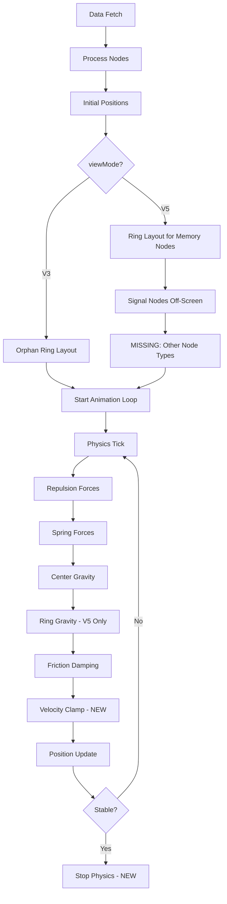

# Dashboard Physics Fix Plan - "Two Dots" Ghost Node Issue

## Executive Summary

The "two dots" ghosting artifact is caused by **physics simulation instability**, not data duplication. The backend data is clean (verified). The issue is in the frontend rendering/physics loop in [`GraphCanvas.tsx`](src/dashboard/ui/src/components/GraphCanvas.tsx).

---

## Root Cause Analysis

### Finding 1: Random Initial Positions (CRITICAL)

**Location**: Lines 699-700

```typescript
x: Math.random() * width,
y: Math.random() * height,
```

**Problem**: Every node starts at a completely random position. When nodes are randomly scattered:
- Some nodes start very close together → massive repulsion forces
- Some nodes start at edges → weak gravity pull initially
- Creates an "explosion" effect on first physics tick

### Finding 2: V5 Mode Incomplete Node Positioning

**Location**: Lines 764-815

**Problem**: In V5 mode:
- Memory nodes → positioned in rings ✓
- Signal nodes → moved off-screen ✓
- **Entity/Cluster/Session/Concept nodes → NOT positioned** ❌

These non-memory nodes retain their random positions, causing chaos in the physics simulation.

### Finding 3: Physics Force Imbalance

**Location**: Lines 1150, 1219, 1248

| Force | Value | Issue |
|-------|-------|-------|
| Repulsion | `400 / (dist * dist)` | Very strong at close range |
| Center Gravity | `dx * 0.012` | Weak compared to repulsion |
| Friction | `vx *= 0.5` | Moderate damping |

When nodes start close together (random init), repulsion dominates and "explodes" the graph.

### Finding 4: Ring Gravity Oscillation (V5 Mode)

**Location**: Lines 1236-1243

```typescript
if (Math.abs(distError) > ringZone) {
  const pullStrength = 0.02;
  // ... applies force toward ring radius
}
```

**Problem**: Orphan nodes (no connections) in V5 mode:
1. Get positioned in a ring
2. Have no edge springs to stabilize them
3. Ring gravity pulls them toward radius
4. Repulsion from other nodes pushes them away
5. They oscillate between two positions → "two dots" visual artifact

### Finding 5: No Stabilization Detection

**Problem**: The simulation runs forever without checking if it has settled. This means:
- Nodes never "lock in" to final positions
- Oscillations continue indefinitely
- No thermal cooling to reduce movement over time

---

## Fix Plan

### Fix 1: Center-Clustered Initial Positions

**Change**: Instead of random positions, start all nodes near center.

```typescript
// BEFORE (Line 699-700)
x: Math.random() * width,
y: Math.random() * height,

// AFTER
x: (width / 2) + (Math.random() - 0.5) * 100,  // ±50px from center
y: (height / 2) + (Math.random() - 0.5) * 100,
```

**Impact**: Nodes start clustered, reducing initial explosion forces.

### Fix 2: Position ALL Node Types in V5 Mode

**Change**: Add explicit positioning for non-memory nodes.

```typescript
// After line 815, add:
// Position non-memory, non-signal nodes near center
const otherNodes = processedNodes.filter(
  (n: any) => n.type !== 'memory' && n.type !== 'signal'
);
otherNodes.forEach((node: any) => {
  node.x = centerX + (Math.random() - 0.5) * 60;
  node.y = centerY + (Math.random() - 0.5) * 60;
  node.fx = null;
  node.fy = null;
});
```

### Fix 3: Increase Center Gravity, Add Thermal Cooling

**Change**: Stronger gravity + velocity decay over time.

```typescript
// Line 1219: Increase gravity
node.vx += dx * 0.025;  // Was 0.012

// Line 1248: Add thermal cooling
const coolingFactor = Math.max(0.3, 1 - (frameCount / 1000));
node.vx *= 0.5 * coolingFactor;
node.vy *= 0.5 * coolingFactor;
```

### Fix 4: Stabilization Detection

**Change**: Stop physics when nodes settle.

```typescript
// Add state for frame counting
const frameCountRef = useRef(0);
const isStableRef = useRef(false);

// In animate function:
frameCountRef.current++;
const totalVelocity = activeNodes.reduce(
  (sum, n) => sum + Math.abs(n.vx) + Math.abs(n.vy), 0
);
if (totalVelocity < 0.5 && frameCountRef.current > 100) {
  isStableRef.current = true;
}
```

### Fix 5: Velocity Clamping (Safety Net)

**Change**: Prevent runaway velocities.

```typescript
// After line 1272, add:
const MAX_VELOCITY = 10;
node.vx = Math.max(-MAX_VELOCITY, Math.min(MAX_VELOCITY, node.vx));
node.vy = Math.max(-MAX_VELOCITY, Math.min(MAX_VELOCITY, node.vy));
```

---

## Implementation Order

1. **Fix 1** (Center-clustered init) - Most impactful, prevents explosion
2. **Fix 5** (Velocity clamping) - Safety net, prevents runaway
3. **Fix 2** (All node types) - Completes V5 mode positioning
4. **Fix 3** (Force balance) - Fine-tunes stability
5. **Fix 4** (Stabilization) - Optimization, stops unnecessary computation

---

## Verification Steps

1. Run `npm run build` in `src/dashboard/ui/`
2. Restart Python server
3. Load dashboard
4. Verify:
   - [ ] No nodes fly off-screen on load
   - [ ] "CRITICAL BUG" memory appears exactly once
   - [ ] Graph stabilizes in center within 2-3 seconds
   - [ ] No visual "ghost" or "two dots" artifacts

---

## Files to Modify

| File | Changes |
|------|---------|
| [`GraphCanvas.tsx`](src/dashboard/ui/src/components/GraphCanvas.tsx) | All 5 fixes |

---

## Risk Assessment

| Risk | Mitigation |
|------|------------|
| Changes affect V3 mode | Test both V3 and V5 modes |
| Over-damping makes graph static | Tune friction/cooling values |
| Edge cases with many nodes | Test with 100+ node dataset |

---

## Diagram: Physics Flow



---

## Conclusion

The "two dots" issue is a **physics simulation artifact** caused by:
1. Random initial positions creating explosive forces
2. Incomplete node positioning in V5 mode
3. Force imbalance allowing oscillations
4. No stabilization to "lock in" final positions

The fix is straightforward: center-cluster initial positions, balance forces, and add stabilization detection.
